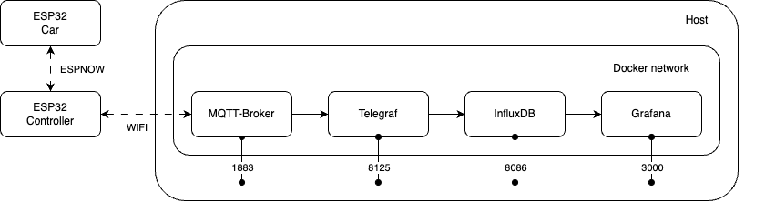

# Umweltkarre

### Autoren
Tom Mohr, Tinko Reinhold, Gregor Knoche

### Abgabe
22.09.2025

---

## 1. Einleitung
Die Umweltkarre ist ein IoT-Fahrzeug, das Umwelt- und Luftqualitätsdaten erfasst und sie in Echtzeit über MQTT bereitstellt. Zusätzlich kann das Fahrzeug per Funkfernsteuerung (ESPNOW) mit einem zweiten ESP32-Controller gesteuert werden. Ziel ist ein funktionsfähiger, robust implementierter Demonstrator, der typische IoT-Bausteine kombiniert: Sensorik (Temperatur, Luftdruck, Feuchte, TVOC, eCO2), drahtlose Konnektivität (Wi-Fi, ESPNOW), Zeitsynchronisation (NTP) und Cloud-Integration (MQTT).

Motivation: Im Kontext smarter Mobilität und Umwelterfassung sollen kostengünstige, energieeffiziente und leicht integrierbare Plattformen entstehen, die Messwerte sammeln und ad hoc miteinander kommunizieren. Die Umweltkarre dient als Lern- und Demonstrationsobjekt für Embedded- und IoT-Entwicklung.

## 2. Technischer Hintergrund
- Microcontroller/SoC: ESP32 (Varianten: ESP32-S3, ESP32-C6 Devkit). 32-bit, Wi-Fi, ausreichend RAM/Flash für Netzwerk-Stack und Sensorik.
- Sensorik: 
  - BME/BMP280 (Temperatur, Luftdruck, optional Luftfeuchtigkeit)
  - SGP30 (TVOC, eCO2, IAQ)
- Kommunikation:
  - Wi-Fi STA-Modus für Internetzugang und MQTT
  - ESPNOW (proprietäres 2.4 GHz Peer-to-Peer-Protokoll von Espressif) für latenzarme Fernsteuerung
  - MQTT als Publish/Subscribe-Protokoll
- Zeit: NTP (Network Time Protocol) für Zeitbasis, z. B. für Timestamps im Log/MQTT.
- Software-Stack: ESP-IDF/PlatformIO, FreeRTOS, C.

## 3. Projektidee und Anforderungen
Kurzbeschreibung: Ein ESP32-basiertes Fahrzeug („Car“) misst kontinuierlich Umweltparameter und publiziert diese per MQTT. Ein zweiter ESP32 („Controller“) sendet Steuerkommandos via ESPNOW an das Fahrzeug. Das System kann Peers automatisch entdecken und verbindet sich eigenständig mit dem WLAN und einem MQTT-Broker.

Zielgruppe: Studierende und Entwickler, die IoT-Grundlagen (Sensorik, Netz, Echtzeit, drahtlose Steuerung) praktisch erproben möchten. Einsatz denkbar in Lehre, Demos und kleinen Citizen-Science-Projekten.

Funktionale Anforderungen:
- Erfassen und Publizieren von TVOC, eCO2, Temperatur, Luftdruck und optional Feuchte über MQTT.
- Robuste WLAN-Anbindung und NTP-Zeitsynchronisation.
- Peer-Discovery und -Kommunikation via ESPNOW; Rollenbildung Controller/Car.
- Joystick-Eingabe am Controller; Umsetzen in Fahrbefehle am Car.

Nicht-funktionale Anforderungen:
- Stabiler Betrieb über mehrere Stunden; periodische Messung alle ~10 s.
- Moderate CPU-/RAM-Nutzung, geeignet für ESP32-Klassen.
- Latenzarmes ESPNOW (<100 ms) für Steuerkommandos.

## 4. Architektur und Umsetzung
Übersicht:
- WLAN- und NTP-Initialisierung beim Systemstart.
- ESPNOW-Stack mit Broadcast-basiertem Discovery-Mechanismus. Rollen: Controller (sendet) oder Car (empfängt). Auto-Rollenzuteilung anhand empfangener/gesendeter Joystick-Frames.
- I2C-Sensorik (BMX280, SGP30) am Car; periodische Erfassung und Versand über MQTT.
- MQTT-Client mit Puffer/Queue für stabile Publishes.

Komponenten und Schnittstellen:
- src/wlan.c: STA-Initialisierung, Verbindungsmanagement.
- src/ntp.c: Zeitbezug via ntp_obtain_time().
- src/espnow.c: Senden/Empfangen ganzer Frames; Peer-Management.
- src/joystick.c/.h: ADC-Einlesung, Kalibrierung, Prozent-Normierung, Button.
- src/sensors.c: I2C-Setup, BMX280/SGP30-Treiberanbindung.
- src/mqtt.c: Verbindung zum Broker, mqtt_enqueue() Pufferung, Topics.
- src/main.c: Lebenszyklus, Tasks, Discovery, Rollenzuweisung, Sensorloop.

Entscheidungen:
- ESPNOW für Steuerung statt MQTT, um Latenz und Abhängigkeit vom Broker zu vermeiden.
- MQTT für Telemetrie, da Interoperabilität, Tools und Backend-Anbindung wichtig sind.
- NTP statt RTC-Batterie: einfach, präzise genug, wenig Hardware-Aufwand.

## 5. Implementierung
Wesentliche Abläufe:
1) Systemstart und Netzanbindung (main.c)
- NVS init, Wi-Fi STA init (initSTA(), waitForSTAConnected()), NTP-Aufruf ntp_obtain_time().
- ESPNOW-Init mit espnow_init(WIFI_IF_STA, on_espnow_recv, ...).
- Broadcast-Peer registrieren und eigene MAC loggen.

2) Peer Discovery (main.c)
- Alle 2 s Broadcast HELLO mit Token "C960-ESPNOW-TOKEN".
- Empfangs-Callback verifiziert Token/Version und fügt neue Peers hinzu; sendet ACK Unicast.

3) Rollen und Joystick
- joystick_sender_task: ADC-Kalibrierung (Mittelpunkt, Sweep), Mapping auf -100..+100 %.
- Controller sendet Befehlsframes (cmd_joystick_t) via ESPNOW an bekannte Peers.
- Car erkennt Rolle automatisch beim ersten gültigen Befehl und ruft apply_motor_command_log().

4) Sensorik und MQTT
- SGP30: sgp30_IAQ_measure().
- BMX280: Forced-Mode Messung; bmx280_readoutFloat(), Druck in hPa.
- MQTT-Themen:
  - /sensor/tvoc, /sensor/eco2, /sensor/temperature, /sensor/pressure, optional /sensor/humidity
- Versand über mqtt_enqueue(topic, payload, len, qos=1, retain=0) im 10 s Intervall.

5) Fehlerbehandlung und Robustheit
- ESP_ERROR_CHECK bei kritischen Aufrufen.
- Pufferung der Publishes, Wiederholversuche durch MQTT-Client.
- Discover/ACK-Handshake reduziert „Geister-Peers“.

Sprachen/Tools:
- C/ESP-IDF, FreeRTOS, PlatformIO; externe Sensor-Treiber in components/.

## 6. Tests und Ergebnisse
- NTP-Test: test/test_ntp_obtain_time/test_main.c verifiziert erfolgreiche Zeitsynchronisation.
- Manuelle Tests: 
  - MQTT-Subscriptions mit mosquitto_sub auf die Topics; periodische Werte sichtbar.
  - ESPNOW-Steuerung: niedrige Latenz, stabile ACKs; Discovery innerhalb weniger Sekunden.
- Messwerte: Temperatur und Druck stabil; SGP30 benötigt Burn-in/Init-Phase für stabile IAQ.

Bekannte Einschränkungen:
- Feuchte ist aktuell per DISABLE_HUMIDITY deaktiviert, kann einfach wieder aktiviert werden.
- Reichweite und Interferenz abhängig von 2.4 GHz Umgebung.

## 7. Fazit und Ausblick
Das System erfüllt die gesetzten Ziele: Sensorwerte werden zuverlässig erfasst und publiziert, die Fernsteuerung arbeitet latenzarm und robust. Die modulare Struktur erleichtert Erweiterungen.

Ausblick:
- Motorsteuerung physisch anbinden (PWM, H-Brücke) und Sicherheitslogik ergänzen.
- Persistente Kalibrierung des Joysticks (NVS).
- TLS-gesichertes MQTT, Konfiguration via Web-UI oder BLE-Provisioning.
- OTA-Updates und einfache Flottenverwaltung.

## 8. Repository-Überblick
Struktur (Auszug):
- src/: Anwendungscode (main, wlan, mqtt, ntp, espnow, sensors, joystick)
- include/: Header inkl. secrets.h (Beispiel: include/example.secrets.h)
- components/: externe Sensor-Treiber (bmx280, sgp30)
- test/: Unit-/Komponententests (z. B. NTP)
- docs/: Dokumente (dieser Bericht)

Setup (PlatformIO):
1. secrets.h auf Basis von include/example.secrets.h ausfüllen (WLAN/MQTT).
2. Ziel-Board/Environment in platformio.ini wählen.
3. Build & Flash via PlatformIO. Serielle Konsole für Logs öffnen.
4. Joystick für die Kalibrierung in alle Richtungen bewegen.

Beispielnutzung:
- MQTT-Broker starten (z. B. mosquitto) und auf Topics /sensor/* subscriben.
- Zweites Board als Controller flashen; Joystick bewegen → Car reagiert über ESPNOW.

## 9. Lizenz
- Projektlizenz: siehe LICENSE (OSS, kompatibel mit verwendeten Komponenten).
- Drittlizenzen: components/bmx280 (MIT/ähnlich), components/sgp30 (entsprechend in den Unterordnern dokumentiert).
